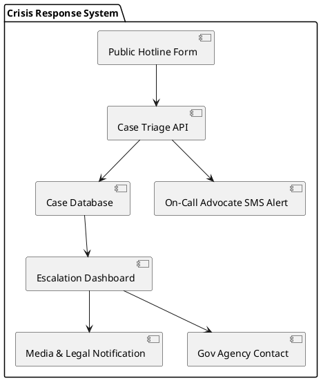

--
layout: default
title: Full Protocol Spec
---

# SPEC-001: The Felicia Harris Protocol

## Background

The Felicia Harris Protocol was developed in response to the catastrophic systemic neglect of Felicia Harris—a disabled, non-verbal, post-stroke, epileptic Black woman—who was repeatedly denied access to emergency services and housing support despite visible medical and legal needs. Her crisis, and the tireless advocacy that followed, revealed massive gaps in accountability, crisis intervention, housing justice, legal access, caregiver support, and policy responsiveness.

This protocol is grounded in the lived experiences of survivors and advocates and formalizes a replicable model for community-driven crisis intervention, systemic accountability, and structural reform. It is named to honor Felicia and to ensure that no one facing similar barriers remains invisible or unprotected.

## Requirements

The Felicia Harris Protocol aims to institutionalize survivor-driven crisis response and system accountability. Key requirements are derived from real-world failures and the lived cases that shaped each division.

### Must Have
- Real-time crisis response for disabled and vulnerable individuals
- Documented government inaction cases (with escalation tools)
- Legal aid for ADA/FEHA/Unruh complaints
- Public reporting system for housing rights violations
- Advocacy for caregivers without compensation
- Survivor-centered storytelling tools for communication disabilities

### Should Have
- Public databases of failing agencies and landlords
- Interactive policy dashboard or map
- Pre-filled legal templates for small claims and complaints
- On-call media/legal advocacy liaisons

### Could Have
- Annual recognitions for whistleblowers
- Volunteer training modules for caregiver support and ADA education
- Policy tracker linked to survivor-originated legislation

### Will Not Have (in MVP)
- 24/7 hotline staffed by professionals (pending funding)
- Automated ADA litigation filing bots (future release)

## Method

*(Use separate markdown files or links for each sub-division if too long)*

### Crisis Response Accountability Unit

...

*(Repeat for all other divisions using markdown + PlantUML block for each)*

## Implementation

Implementation steps with MVP launch details, no-code tools, team roles, and automation stack.

## Milestones

- [ ] Protocol published on GitHub Pages
- [ ] Crisis form launched
- [ ] First advocacy escalation completed
- [ ] Caregiver aid fund activated
- [ ] Policy brief published

## Gathering Results

Quantitative and qualitative metrics for evaluating impact and course correction.
